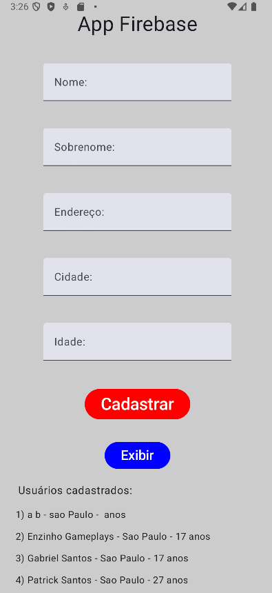

# 📱 App - Conectado com Firebase

<p align="center">
  
</p>


Um aplicativo simples e funcional que utiliza o [Firebase](https://firebase.google.com/) para autenticação, banco de dados em tempo real e/ou armazenamento. Este projeto tem como objetivo demonstrar uma integração básica com os serviços do Firebase em um app leve e fácil de entender.

## 🚀 Funcionalidades

- 🔐 Autenticação com Firebase
- 💾 Leitura e gravação de dados em tempo real
- 🧪 Código limpo e bem estruturado para estudos e testes

## 🛠️ Tecnologias utilizadas

- Kotlin
- Firebase (Auth, Realtime Database / Firestore, Storage)

## 📦 Como rodar o projeto

1. Clone este repositório e abra no seu andorid Studio:
   ```bash
   git clone https://github.com/seu-usuario/nome-do-repositorio.git
